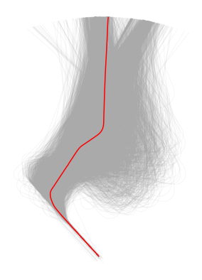
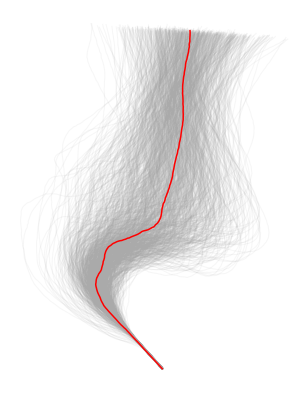

Trajectory generation
=====================

This library provide a Generation class for creating synthetic traffic data.
It implements fit() and sample() methods that call the corresponding methods
in the generative model passed as argument (``generation``).

You can import this class with the following code:

.. code:: python

    from traffic.algorithms.generation import Generation

There are several ways to instanciate a Generation object:

* using the classic __init__() method;

.. code:: python

    from sklearn.mixture import GaussianMixture
    from sklearn.preprocessing import MinMaxScaler

    g = Generation(
        generation=GaussianMixture(n_components=2),
        features=["x", "y", "altitude", "timedelta"],
        transform=MinMaxScaler(feature_range=(-1, 1))
    )

* using a backup;

.. code:: python

    g = Generation.from_file("path/to/generation/backup")

* using an API provided in the Traffic class. It will return a fitted 
  Generation object to the Traffic object.

.. code:: python

    from traffic.core import Traffic

    t: Traffic

    g = t.generation(
        generation=GaussianMixture(n_components=2),
        features=["x", "y", "altitude", "timedelta"],
        transform=MinMaxScaler(feature_range=(-1, 1))
    )

In the case your generative model is not fitted to any Traffic object you can
use the fit() method. Depending on the generative model used the fit() method
can take some time, specifically if you use a deep generative model.

.. code:: python

    g = g.fit(some_traffic)

.. note::
    The following codes are equivalent: ``t.generation(...)`` and
    ``Generation(...).fit(t)``.

.. warning::
    Make sure the generative model you want to use implements fit() and
    sample() methods.

Once fitted you can generate new Traffic objects using sample() method.
The following code generates 100 trajectories.

.. code:: python

    new_traffic = g.sample(100)

.. rubric::
    Generation Example

We want to generate more samples of the traffic displayed below.

.. code:: python

    import matplotlib.pyplot as plt
    from traffic.core.projections import EuroPP

    t = Traffic.from_file("path/to/traffic/data")

    with plt.style.context("traffic"):
        ax = plt.axes(projection=EuroPP())
        t.plot(ax, alpha=0.1)
        t.centroid(nb_samples=None, projection=EuroPP())
        .plot(ax, color="red", alpha=1) 

We preprocess the traffic data before the generation using methods provided
by `traffic <https://traffic-viz.github.io>`_. You may want to be sure that
the trajectories have the same number of observations for instance and do not
lack values for any chosen features. Here, an example of preprocessing with a
resampling of 200.

.. code:: python

    # removes any flight missing track values, resamples flight to 200
    # observations and unwrap track angle feature.
    t = (
        t
        .query("track"=="track")
        .assign_id()
        .resample(200)
        .unwrap()
        .eval(max_workers=4, desc="")
    )

    # enriches Traffic DataFrame with x and y columns, respectively
    # projections of longitude and latitude.
    t = t.compute_xy(projection=EuroPP())

    # enriches Traffic DataFrame with a timedelta column to get time
    # references in seconds.
    t = Traffic.from_flights(
        flight.assign(
            timedelta=lambda r: (r.timestamp - flight.start).apply(
                lambda t: t.total_seconds()
            )
        )
        for flight in t
    )

Once the preprocessing done, we can use the relevant API to instanciate and fit
a Generation object.

.. code:: python

    gen_model = t.generation(
        generation=GaussianMixture(n_components=2),
        features=["x", "y", "altitude", "timedelta"],
        transform=MinMaxScaler(feature_range=(-1, 1))
    )

Finally we can sample the model.

.. code:: python

    t_gen = gen_model.sample(1000)

    with plt.style.context("traffic"):
        ax = plt.axes(projection=EuroPP())
        t_gen.plot(ax, alpha=0.1)
        t_gen.centroid(nb_samples=None, projection=EuroPP())
        .plot(ax, color="red", alpha=1)

Do not forget to save the model if you want to use it later.

.. code:: python

    gen_model.save("path/to/backup")