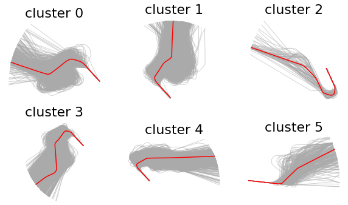

## Summary

- Introduction
- DBSCAN + GMM
- PCA + normal law
- PCA + kde
- Autoencoders
- Variational Autoencoder
- Vine Copula Autoencoder
- Metrics

## Introduction

# Probabilistic Model

## DBSCAN + GMM

\begin{enumerate}
    \item Clustering
\end{enumerate}

- \alert{Limitations:} noisy output

## DBSCAN + GMM

{ width=70% }

## Dimensionality reduction

# Deep Generative Models

## Autoencoders

## Variational Autoencoder

## Vine Copula Autoencoder

## Metrics